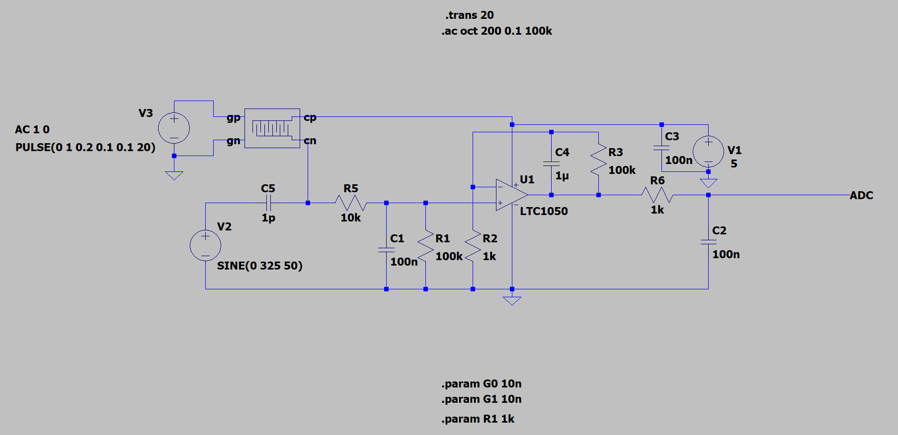
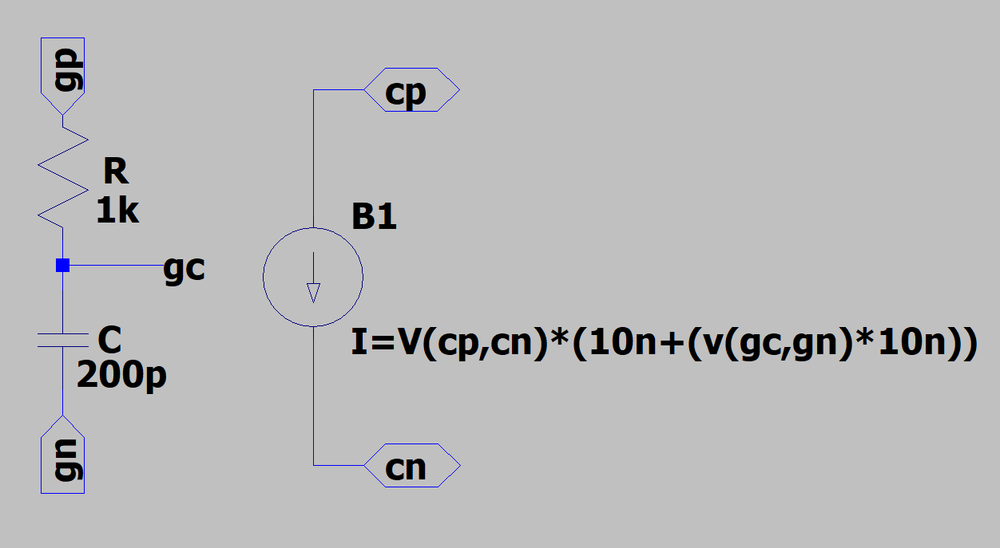

# 2025-2026-4GPa-doctorgil-paupratt

# 4A GP - Projet "Du capteur au banc de test" - I4PMH21

## Sommaire

* [Objectif du projet](#objectif-du-projet)
* [Philosophie du projet : Sobriété et Efficacité](#philosophie-du-projet--sobriété-et-efficacité)
* [Livrables](#livrables)
* [LTSpice](#ltspice)
* [KiCad](#kicad)
* [Shield](#shield)
* [Code Arduino](#code-arduino)
* [Application Android](#application-android)
* [Datasheet](#datasheet)

---

## Objectif du projet

Dans le cadre d'un cours dispensé lors du 2nd semestre de 4ème année de Génie Physique à l'INSA de Toulouse, il nous a été proposé de réaliser un **capteur low-tech à base de graphite**, puis d'en faire une analyse critique argumentée pour en cerner les potentialités mais également pour évoquer des solutions d'amélioration. Ainsi, ce projet nous a permis de balayer l'ensemble du domaine ; du capteur jusqu'à la réalisation d'une **datasheet** et du **banc de test**.

---
## Philosophie du projet : Sobriété et Efficacité

Face à l'urgence climatique et à la demande croissante de systèmes à faible empreinte carbone, ce projet s'inscrit dans une démarche de **sobriété technologique**. Simplifier les composants pour les rendre plus efficaces énergétiquement reste un défi majeur de l'ingénierie moderne.

Si la réalisation de capteurs à haute sensibilité possède une forte valeur ajoutée, il est primordial de questionner nos besoins réels : avons-nous systématiquement besoin d'un capteur ultra-précis s'il consomme davantage ? Ou un capteur plus simple, adapté à l'usage final, est-il suffisant ?

Le choix d'un **capteur graphite "low-tech"** illustre ce compromis (trade-off) entre précision et consommation. Plutôt que de viser la performance absolue au prix d'une complexité accrue, nous avons privilégié une solution optimisée, cohérente avec les ressources disponibles et les exigences réelles du cahier des charges.

---

## Livrables

> [!TIP]
> Puedes añadir aquí una breve descripción de lo que contiene la carpeta de entregables.
L'ensemble du projet comprend les éléments suivants :

* **Un shield PCB** branché à une board **Arduino UNO** sur lequel nous retrouverons différents composants tels que :
    * Un capteur graphite
    * Un circuit d'amplification transimpédance
    * Un module Bluetooth
    * Un encodeur rotatoire
    * Un potentiomètre digital (*qui vient remplacer la résistance R2 du circuit d'amplification*)
    * Un capteur de contrainte commercial
* **Une simulation LTSpice** du circuit transimpédance
* **Un fichier KiCad** du shield avec l'ensemble des composants cités en amont
* **Un code Arduino** qui gère le fonctionnement et les communications des modules avec la board
* **Un fichier APK Android** (conçue à l'aide du site *MIT APP Inventor*) qui permet, à partir d'un smartphone Android, de gérer l'interface avec le shield Arduino UNO par le biais d'une communication Bluetooth
* **La datasheet** du capteur graphite

---

## LTSpice

Afin de valider la faisabilité du projet et d'anticiper le comportement dynamique de notre système, nous avons simulé la chaîne de conditionnement sous LTSpice.Le défi majeur réside dans l'impédance extrêmement élevée du capteur (de l'ordre du $G\Omega$), qui génère des courants infimes, de l'ordre du nanoampère ($nA$). Pour rendre ce signal exploitable par un microcontrôleur, il est impératif de le filtrer contre les bruits parasites et de l'amplifier de manière significative. Le montage de transimpédance présenté ci-dessous remplit cette fonction critique :

Circuit d'amplification/atténuation

Modélisation du capteur

Ce montage se compose de trois filtres passe-bas distincts pour optimiser le rapport signal/bruit :

* **Premier étage ($R_5, C_1, R_1$)** : Filtre les bruits en courant sur le signal d'entrée induits par l'alimentation 5V (symbolisée par 'SINE' + $C_3$).
* **Deuxième étage ($C_4, R_3$)** : Réduit spécifiquement la composante de bruit à **50 Hz** induite par le réseau électrique ambiant.
* **Troisième étage ($R_6, C_2$)** : Placé en sortie de l'amplificateur, il atténue le bruit thermique et intrinsèque du circuit.

Grâce à ce conditionnement, nous déterminons la résistance du capteur graphite par la formule suivante :

$$R_{meas} = \frac{V_{cc}}{V_{ADC}} \cdot R_1 \cdot \left(1 + \frac{R_3}{R_{potentio}}\right) - R_1 - R_5$$

Afin de valider le comportement du système, deux simulations ont été effectuées :
1. **Analyse de l'amplification** : Vérification de la dynamique du signal de sortie.
2. **Analyse spectrale** : Confirmation de l'atténuation des fréquences non souhaitées (réjection du 50 Hz).
*Simulation des circuits analogiques de conditionnement du signal.*

## KiCad
*Conception du PCB et schématiques du circuit.*

## Shield
*Détails sur le shield Arduino conçu pour l'interface du capteur.*

## Code Arduino
*Algorithmes d'acquisition et de traitement de données.*

## Application Android
*Interface utilisateur pour la visualisation des données en temps réel.*

## Datasheet
*Spécifications techniques du capteur de graphite réalisé.*